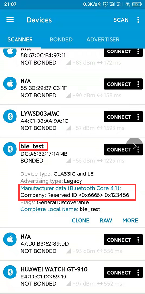
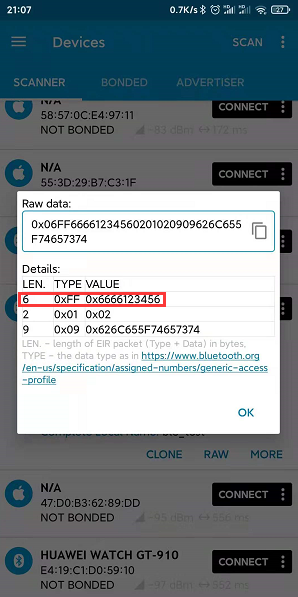
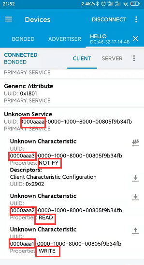

bluetooth是用来调试bluez比较好的一款工具。可以设置bluez作为slave或者master。也可以设置ble或经典蓝牙设备。

#### BLE设备

* 设置名称并连接

```
pi@raspberrypi:~$ bluetoothctl		# 启动bluetoothctl
Agent registered
[bluetooth]# power on				# 蓝牙芯片上电
Changing power on succeeded
[bluetooth]# menu advertise			# 切换到advertise子菜单，主要用于设置广播的参数
# 设置广播数据中的manufacturer选项,id(0x6666)代表的是公司在蓝牙协会申请公司ID号。
# 后面的是广播数据，一般这个字段能设置的最大长度是31个字节。
[bluetooth]# manufacturer 0x6666 0x12 0x34 0x56	# 
[bluetooth]# name ble_test			# 设置ble广播的名称
# 使得设备可发现，
[bluetooth]# discoverable on		
[bluetooth]# back					# 返回主菜单

[bluetooth]# advertise on			# 设备开始广播
[CHG] Controller DC:A6:32:17:14:4B SupportedInstances: 0x04
[CHG] Controller DC:A6:32:17:14:4B ActiveInstances: 0x01
Advertising object registered
Tx Power: off
LocalName: ble_test
Apperance: off
Discoverable: on

# 广播之后，就可以使用手机上的BLE app搜索到，并进行连接。以下是连接的log。
[NEW] Device 77:96:C8:E7:74:BD 77-96-C8-E7-74-BD
[NEW] Primary Service
        /org/bluez/hci0/dev_77_96_C8_E7_74_BD/service0001
        00001801-0000-1000-8000-00805f9b34fb
        Generic Attribute Profile
[NEW] Characteristic
        /org/bluez/hci0/dev_77_96_C8_E7_74_BD/service0001/char0002
        00002a05-0000-1000-8000-00805f9b34fb
        Service Changed
[CHG] Device 77:96:C8:E7:74:BD UUIDs: 00001800-0000-1000-8000-00805f9b34fb
[CHG] Device 77:96:C8:E7:74:BD UUIDs: 00001801-0000-1000-8000-00805f9b34fb
[CHG] Device 77:96:C8:E7:74:BD ServicesResolved: yes
[CHG] Device 77:96:C8:E7:74:BD Name: MIX2S
[CHG] Device 77:96:C8:E7:74:BD Alias: MIX2S
```
使用ble app显示如下：





* 添加属性

在上面的步骤，advertise on之前，可以添加属性。添加完之后再进行广播。

```
[bluetooth]# menu gatt					# 切换到gatt子菜单
Menu gatt:
Available commands:
-------------------
list-attributes [dev]                             List attributes
select-attribute <attribute/UUID>                 Select attribute
......
[bluetooth]# register-service 0xaaaa			# 注册一个uuid是0xaaaa的service
[NEW] Primary Service
        /org/bluez/app/service0x11b3318
        0xaaaa
        Unknown
[/org/bluez/app/service0x11b3318] Primary (yes/no): yes		# 选择yes
[bluetooth]# register-characteristic 0xaaa1 write			# 为service添加一个uuid是0xaaa1的属性，只读
[NEW] Characteristic
        /org/bluez/app/service0x11b3318/chrc0x11afba8
        0xaaa1
        Unknown
[/org/bluez/app/service0x11b3318/chrc0x11afba8] Enter value: 0	# 设置初值
[bluetooth]# register-characteristic 0xaaa2 read			# 为service添加一个uuid是0xaaa2的属性，只写
[NEW] Characteristic
        /org/bluez/app/service0x11b3318/chrc0x11b3b68
        0xaaa2
        Unknown
[/org/bluez/app/service0x11b3318/chrc0x11b3b68] Enter value: 0	# 初值
[bluetooth]# register-characteristic 0xaaa3 notify			# # 为service添加一个uuid是0xaaa3的属性，通知
[NEW] Characteristic
        /org/bluez/app/service0x11b3318/chrc0x11b4008
        0xaaa3
        Unknown
[/org/bluez/app/service0x11b3318/chrc0x11b4008] Enter value: 0	# 初值
[bluetooth]# register-application									# 注册这个service
[CHG] Controller DC:A6:32:17:14:4B UUIDs: 00001800-0000-1000-8000-00805f9b34fb
[CHG] Controller DC:A6:32:17:14:4B UUIDs: 00001801-0000-1000-8000-00805f9b34fb
[CHG] Controller DC:A6:32:17:14:4B UUIDs: 0000110e-0000-1000-8000-00805f9b34fb
[CHG] Controller DC:A6:32:17:14:4B UUIDs: 00001200-0000-1000-8000-00805f9b34fb
[CHG] Controller DC:A6:32:17:14:4B UUIDs: 0000110c-0000-1000-8000-00805f9b34fb
[CHG] Controller DC:A6:32:17:14:4B UUIDs: 0000aaaa-0000-1000-8000-00805f9b34fb
Application registered
[CHG] Controller DC:A6:32:17:14:4B UUIDs: 00001800-0000-1000-8000-00805f9b34fb
[CHG] Controller DC:A6:32:17:14:4B UUIDs: 00001801-0000-1000-8000-00805f9b34fb
[CHG] Controller DC:A6:32:17:14:4B UUIDs: 0000110e-0000-1000-8000-00805f9b34fb
[CHG] Controller DC:A6:32:17:14:4B UUIDs: 00001200-0000-1000-8000-00805f9b34fb
[CHG] Controller DC:A6:32:17:14:4B UUIDs: 0000110c-0000-1000-8000-00805f9b34fb
[CHG] Controller DC:A6:32:17:14:4B UUIDs: 0000aaaa-0000-1000-8000-00805f9b34fb
[bluetooth]# back
```

app连接的效果图

